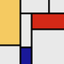

Click to generate a new image.

<canvas data-processing-sources="MondrianGenerator.pde"></canvas>

(c) 2015 <a href="http://faculty.ycp.edu/~dhovemey">David Hovemeyer</a>, made with <a href="http://processingjs.org/">processing.js</a>, <a href="MondrianGenerator.pde">source code</a>

